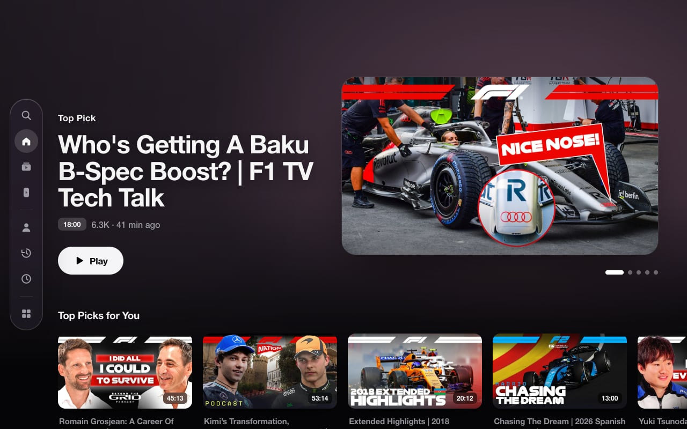
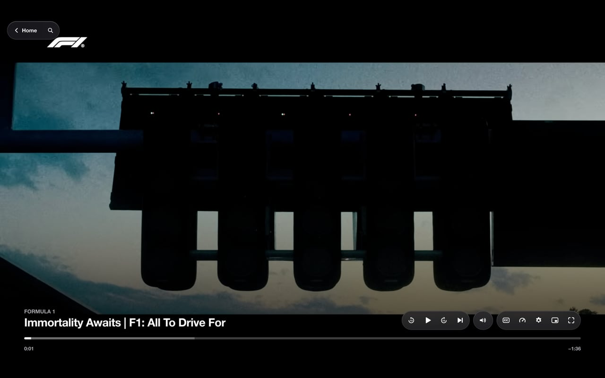
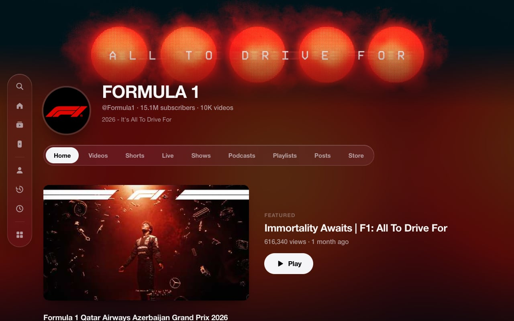
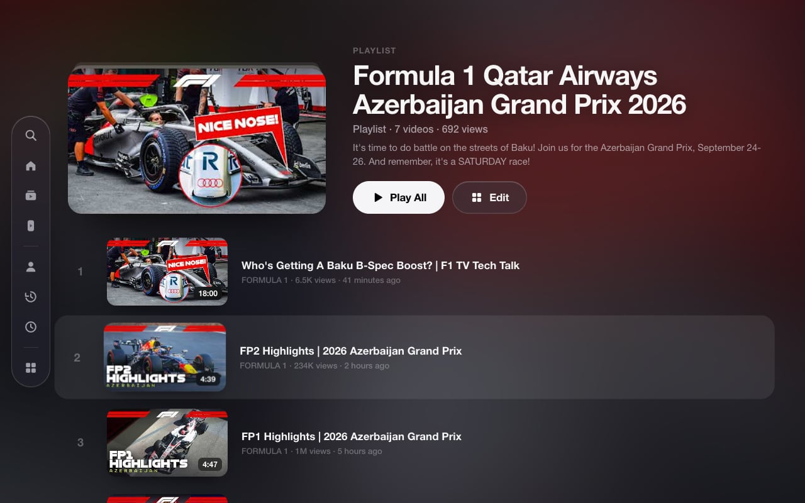
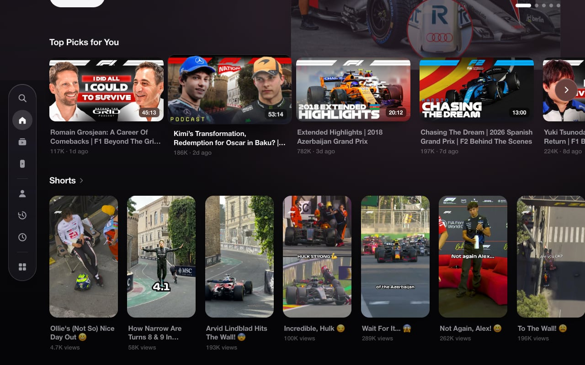
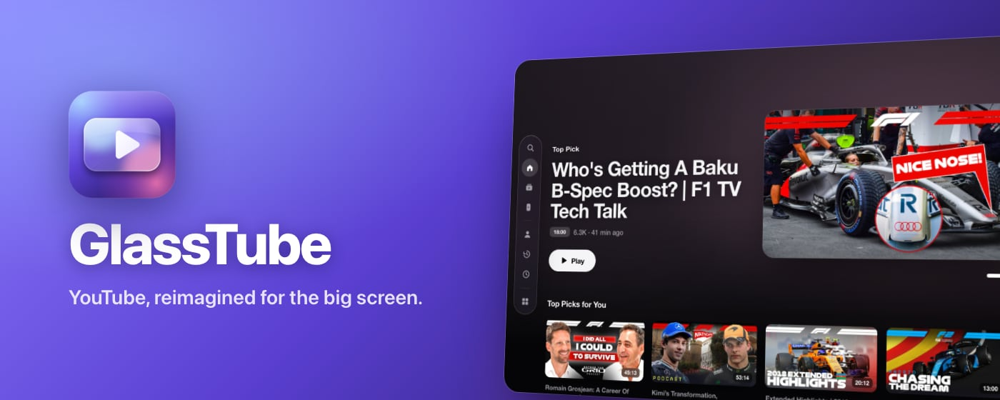

<div align="center">


# GlassTube

**YouTube, reimagined for the big screen.**
A Chrome extension that turns youtube.com into a cinematic, Apple TV–inspired experience with a Liquid Glass design — from the home screen to the player to Picture in Picture.

[](https://github.com/theysap/GlassTube/actions/workflows/ci.yml)
[](https://github.com/theysap/GlassTube/releases)
[](https://developer.chrome.com/docs/extensions/mv3/)
[](LICENSE)

📖 **[Read the user manual](USERMANUAL.md)** — every option explained, known issues and how to report a problem.



</div>

---

## Contents

- [User manual](USERMANUAL.md)
- [Highlights](#highlights)
- [Screenshots](#screenshots)
- [Install](#install)
- [Using GlassTube](#using-glasstube)
- [Settings](#settings)
- [How it works](#how-it-works)
- [Development](#development)
- [Releasing](#releasing)
- [Troubleshooting](#troubleshooting)
- [Privacy](#privacy)
- [Contributing](#contributing)
- [License & trademarks](#license--trademarks)

## Highlights

|                                       |                                                                                                                                                                                                                                                                                                                     |
| ------------------------------------- | ------------------------------------------------------------------------------------------------------------------------------------------------------------------------------------------------------------------------------------------------------------------------------------------------------------------- |
| 🏠 **Top Shelf home**                 | A full-screen hero that rotates through your top picks — Ken Burns motion, scroll parallax and an ambient colour glow — above sideways shelves: Continue Watching (with progress), Top Picks, Subscriptions, Shorts, Mixes & Playlists, Live Now, Watch Later, Explore and endless “More for You” rows.             |
| 🎬 **Cinematic watch page**           | The player fills the screen. Glass capsule controls fade in on demand: −10 s / play / +10 s, next, volume, captions, speed, settings, PiP and full screen, plus a thick scrubber with **storyboard thumbnail previews**. Up Next and playlist shelves, a glass description card and tucked-away comments sit below. |
| 🪟 **Picture in Picture, redesigned** | The video moves into a Document Picture-in-Picture window with tvOS-style glass controls, a scrubber and “Back to tab”. Playback never skips a beat.                                                                                                                                                                |
| 📺 **Every page**                     | **Channels** (banner, avatar, Subscribe, tab pills, shelves), **playlists** incl. Watch Later & Liked (collection header, numbered episode list), **Subscriptions**, **History**, **You**, **search results**, **hashtags** and **hubs** — plus **cinematic Shorts** that keep YouTube's own gestures.              |
| 🔎 **Search**                         | A full-screen search with live results (videos, channels, Shorts, playlists) and recent searches.                                                                                                                                                                                                                   |
| 🕹️ **Remote-style navigation**        | Arrow keys move focus like a Siri Remote; focused cards lift and tilt with a specular glare.                                                                                                                                                                                                                        |
| ⚙️ **Yours to tune**                  | Every part can be switched on or off live from the toolbar popup. Reduce Transparency, Classic View per page, or pause GlassTube entirely.                                                                                                                                                                          |
| 🔒 **Private by design**              | No analytics, no servers, no remote code. Only the `storage` permission.                                                                                                                                                                                                                                            |

## Screenshots

| Cinematic player with glass controls                                                                                        | Channel page                                                                                                      |
| --------------------------------------------------------------------------------------------------------------------------- | ----------------------------------------------------------------------------------------------------------------- |
|   |  |
| **Playlist as a collection**                                                                                                | **Shelves and Shorts**                                                                                            |
|  |              |



<sub>Screenshots feature content from the official Formula 1 YouTube channel (@Formula1).</sub>

## Install

### From the Chrome Web Store

Install **GlassTube** from the Chrome Web Store, then open [youtube.com](https://www.youtube.com) — that's it.
(GitHub Releases carry release notes only; the packaged extension is distributed through the store.)

### From source

```bash
git clone https://github.com/theysap/GlassTube.git
cd GlassTube
npm install
```

Then **Load unpacked** → select the `src/` folder. After editing, press ↻ on the extension card and reload YouTube.

> Requires Chrome (or another Chromium browser) **116+** — needed for Document Picture-in-Picture.
> GlassTube looks its best with the window maximised or in full screen (<kbd>F11</kbd> / <kbd>⌃⌘F</kbd>).

## Using GlassTube

| Where              | What to do                                                                                                                         |
| ------------------ | ---------------------------------------------------------------------------------------------------------------------------------- |
| Home               | Scroll or use the arrow keys through shelves. Hover a card to see it lift and tilt.                                                |
| Sidebar            | Hover the floating glass pill on the left for Search, Home, Subscriptions, Shorts, You, History, Watch Later and **Classic View**. |
| Watch page         | Move the mouse to reveal the controls; hover the scrubber for previews. Scroll down for Up Next, the description and comments.     |
| Picture in Picture | Click the PiP button in the control bar (or press <kbd>Alt</kbd>+<kbd>P</kbd>). Close the window or click “Back to tab” to return. |
| Any page           | Use **Classic View** (sidebar) or **Edit / Manage History** to hand the page back to YouTube's layout for this tab session.        |

### Keyboard shortcuts

| Keys                                                             | Action                                                          |
| ---------------------------------------------------------------- | --------------------------------------------------------------- |
| <kbd>←</kbd> <kbd>↑</kbd> <kbd>→</kbd> <kbd>↓</kbd>              | Move focus around Home, browse pages and search (like a remote) |
| <kbd>Enter</kbd>                                                 | Open the focused item                                           |
| <kbd>/</kbd>                                                     | Open search                                                     |
| <kbd>Esc</kbd>                                                   | Close search / menus / Picture in Picture                       |
| <kbd>Alt</kbd> + <kbd>P</kbd>                                    | Toggle Picture in Picture                                       |
| <kbd>K</kbd> / <kbd>Space</kbd>, <kbd>J</kbd>, <kbd>L</kbd>      | Play-pause, −10 s, +10 s (YouTube's own keys keep working)      |
| <kbd>Space</kbd> <kbd>←</kbd> <kbd>→</kbd> <kbd>M</kbd> (in PiP) | Play-pause, −10 s, +10 s, mute                                  |

## Settings

All options live in the toolbar popup and apply instantly — no reload.

| Setting               | Default | What it does                                                                  |
| --------------------- | ------- | ----------------------------------------------------------------------------- |
| **GlassTube**         | On      | Master switch. Off hands YouTube back exactly as it was.                      |
| Top Shelf Home        | On      | The Apple TV–style home screen.                                               |
| Cinematic Watch Page  | On      | Full-screen player layout, Up Next shelf, glass panels.                       |
| tvOS Player Controls  | On      | Glass controls with scrub previews (needs Cinematic Watch Page).              |
| tvOS Browse Pages     | On      | Channels, playlists, library, feeds, search and hubs.                         |
| Cinematic Shorts      | On      | Ambient glow and glass actions around the Shorts player.                      |
| Picture in Picture    | On      | GlassTube's floating player and <kbd>Alt</kbd>+<kbd>P</kbd>.                  |
| Auto-rotate Top Shelf | On      | Cycle the featured videos every 9 s.                                          |
| Explore Rows          | On      | Music, Gaming and News shelves on Home (always used when your feed is empty). |
| Parallax Tilt         | On      | Cards tilt and glint under the cursor.                                        |
| Reduce Transparency   | Off     | Solid surfaces instead of Liquid Glass.                                       |

## How it works

```
                 youtube.com tab
┌──────────────────────────────────────────────────────────────┐
│ MAIN world                                                   │
│   bridge.js ── reads yt-navigate-finish payloads & renderer  │
│                data, performs SPA navigation, player calls   │
│         ▲ window.postMessage ▼                               │
│ ISOLATED world (content scripts)                             │
│   core ─ settings · routing · DOM helpers · bridge client    │
│   data ─ pure JSON parser (videos, lockups, Shorts, playlists│
│          channels, pages, storyboards)  ← unit-tested        │
│   store ─ home feed · watch data · current page              │
│   ui ─── cards · shelves · grids · sidebar · tilt · focus    │
│   home · watch · controls · pip · browse · shorts · search   │
│   main ─ mounts / unmounts modules per route + settings      │
└──────────────────────────────────────────────────────────────┘
      popup (settings) ⇄ chrome.storage.sync ⇄ service worker (badge)
```

- **Data, not DOM scraping.** GlassTube reads the same JSON YouTube renders from (`ytInitialData`, the payload of every in-app navigation, and live renderer data as feeds page in). A tolerant tree walker normalises old and new renderer shapes (`videoRenderer`, `lockupViewModel`, `shortsLockupViewModel`, playlist and channel renderers…), so small YouTube changes rarely break it.
- **YouTube keeps working underneath.** Home and browse pages are layers over YouTube's own (hidden) page. When you reach the end of a grid, GlassTube nudges the native page to load its next batch and picks up the result — infinite scroll without re-implementing YouTube's API.
- **Native where it matters.** Player controls sit over YouTube's player (its own controls stay in the DOM for captions, settings and ads — which always show YouTube's controls). Subscribe buttons drive YouTube's own. Shorts keep YouTube's player and gestures.
- **Everything is switchable.** All styles are scoped under `html.gt-on`; turning GlassTube off removes every layer and class immediately.

## Development

**Requirements:** Node.js 22+, npm, Chrome 116+.

```bash
npm install          # also installs the git hooks (husky)
npm run check        # lint + unit tests + manifest/version validation
npm run smoke        # drive real youtube.com with the extension loaded (Chrome for Testing)
npm run build        # dist/glasstube-vX.Y.Z.zip
```

| Script                     | Purpose                                                                                |
| -------------------------- | -------------------------------------------------------------------------------------- |
| `npm run lint`             | ESLint, Stylelint and Prettier (check)                                                 |
| `npm run format`           | Prettier (write)                                                                       |
| `npm test`                 | Node's built-in test runner over `tests/`                                              |
| `npm run validate`         | Manifest shape, referenced files, version sync, changelog entry, no remote code        |
| `npm run smoke -- <url …>` | Screenshots + a JSON report per URL into `dist/smoke/` (`HEADFUL=1` to watch)          |
| `npm run build`            | Deterministic zip in `dist/`                                                           |
| `npm run release:local`    | Full Chrome Web Store bundle into `chrome/vX.Y.Z/` (see below)                         |
| `npm run bump -- x.y.z`    | Set the version in `package.json`, `package-lock.json` and the manifest                |
| `npm run assets`           | Re-render the PNG icons from `assets/logo.svg` (add `-- --brand <dir>` for 4K masters) |

### Project layout

```
src/                     ← the extension (load this folder unpacked)
  manifest.json
  background/            service worker (defaults, badge)
  content/               bridge (MAIN world) + isolated modules, see “How it works”
  styles/                theme · home · watch · browse
  popup/                 settings UI
  icons/
scripts/                 build, zip, validate, bump, smoke, screenshots, release notes, hooks
tests/                   unit tests + trimmed YouTube JSON fixtures
store/listing.md         Chrome Web Store copy template
assets/logo.svg          logo source (logo-small.svg: simplified 16–32 px mark)
docs/screenshots/        README images
.github/                 CI + release workflows, issue / PR templates
.husky/                  pre-commit & commit-msg hooks
```

### Git hooks and conventions

- **pre-commit** — refuses anything under `chrome/`, runs lint-staged (ESLint / Stylelint / Prettier on staged files), the unit tests and the validator.
- **commit-msg** — the subject must be exactly `vX.Y.Z`, matching the version in `package.json`, with any details in the commit body; `Co-authored-by` trailers are rejected.
- Every commit bumps the version (`npm run bump -- x.y.z`) and adds a matching section to [CHANGELOG.md](CHANGELOG.md) (Keep a Changelog format).

## Releasing

Public releases (e.g. `v1.0.0`) are cut after testing — ordinary commits are versioned but not released.

1. `npm run bump -- 1.0.0`, write the `## [1.0.0]` section in `CHANGELOG.md`, commit with the subject `v1.0.0`.
2. `npm run release:local` — builds **`chrome/v1.0.0/`** for the Chrome Web Store:

   | File                         | Use                                                                                    |
   | ---------------------------- | -------------------------------------------------------------------------------------- |
   | `glasstube-v1.0.0.zip`       | Upload in the Developer Dashboard                                                      |
   | `store-icon-128x128.png`     | Store icon                                                                             |
   | `promo-small-440x280.png`    | Small promo tile                                                                       |
   | `promo-marquee-1400x560.png` | Marquee promo tile                                                                     |
   | `screenshot-1…5-*.png`       | Five 1280×800 screenshots, opaque PNG (a spare one is in `extras/`)                    |
   | `brand/`                     | 4096 / 1024 / 512 px logo masters                                                      |
   | `store-listing.md`           | Name, summary, description, permission justifications, privacy answers, reviewer notes |
   | `privacy-policy.md`          | Privacy policy text                                                                    |

   `chrome/` (zip, store images, 4K logo) is git-ignored and blocked by the pre-commit hook — it never reaches the repository.

3. Upload `chrome/v1.0.0/glasstube-v1.0.0.zip` and the listing assets in the Chrome Web Store Developer Dashboard.
4. `git tag v1.0.0 && git push origin master --tags` — the **Release** workflow re-runs every check, confirms the tag matches the manifest and publishes a GitHub Release with notes from the changelog. **No zip is attached** — the zip is only for the Chrome Web Store.

### CI

[`ci.yml`](.github/workflows/ci.yml) runs on every push and pull request: lint, unit tests, validation, the commit-message convention for the pushed range, and a build check (the zip is not uploaded anywhere).

## Troubleshooting

| Symptom                                    | Try                                                                                                                                        |
| ------------------------------------------ | ------------------------------------------------------------------------------------------------------------------------------------------ |
| Home shows only Explore rows               | You're signed out or watch history is paused — YouTube has no personal feed to show.                                                       |
| A page looks like plain (dark) YouTube     | It has no cards to lay out (Posts, settings, signed-out feeds) — or Classic View is on; use the “GlassTube View” pill.                     |
| Something looks off after a YouTube update | Toggle GlassTube off/on in the popup, reload the tab, and [open an issue](https://github.com/theysap/GlassTube/issues) with the page type. |
| PiP button does nothing                    | Document PiP needs Chrome 116+ and a click (browsers block PiP without a user gesture). Older browsers fall back to standard video PiP.    |
| Theater mode stays on after disabling      | GlassTube switches YouTube to theater mode for the cinematic player; press <kbd>T</kbd> to toggle it back.                                 |

## Privacy

GlassTube collects nothing: no analytics, no telemetry, no remote code, no third-party requests. Settings live in `chrome.storage.sync`, recent searches in `chrome.storage.local`. To build home rows it may load YouTube pages you could open yourself (history, subscriptions, Watch Later, search) with your existing session. Full policy: [PRIVACY.md](PRIVACY.md).

## Contributing

Found a bug? See [How to report an issue](USERMANUAL.md#how-to-report-an-issue) in the user manual. Issues and pull requests are welcome — please use the templates. Before opening a PR run `npm run check`, try the pages you touched with `npm run smoke`, bump the version and add a changelog entry.

## License & trademarks

[MIT](LICENSE) © 2026 Aashish Paruvada.

GlassTube is an independent project and is not affiliated with, endorsed by or sponsored by YouTube, Google or Apple. YouTube is a trademark of Google LLC; Apple TV and tvOS are trademarks of Apple Inc., referenced only to describe the design inspiration.
